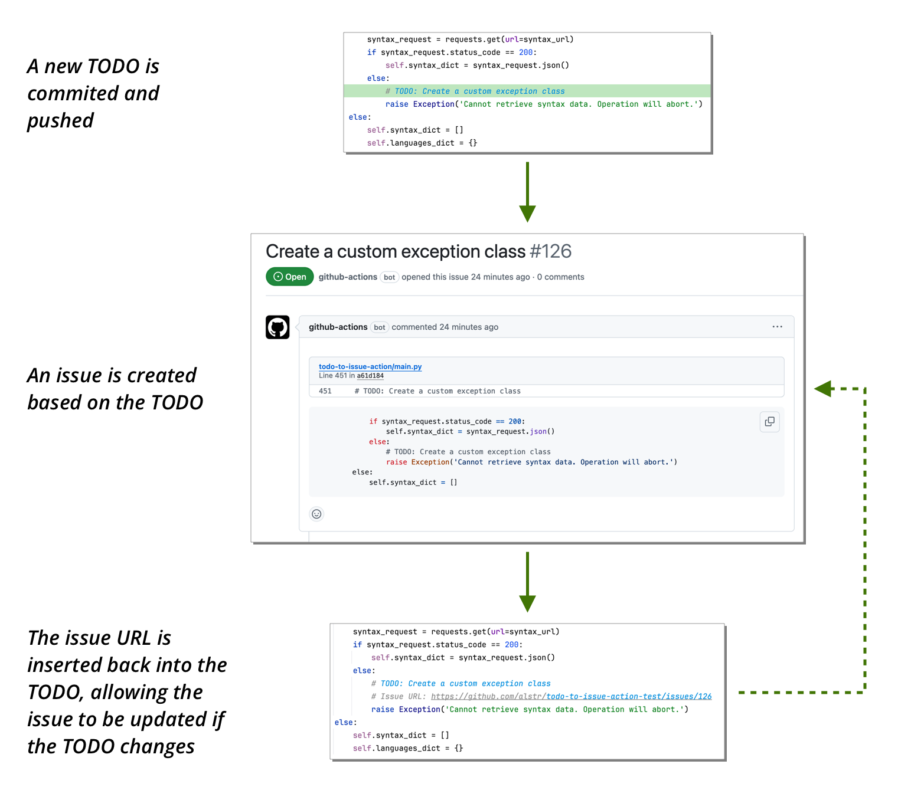

# TODO to Issue

<p>
    <a href="https://github.com/alstr/todo-to-issue-action/releases"></a>
    <a href="https://github.com/alstr/todo-to-issue-action/issues?q=is%3Aopen+is%3Aissue+label%3A%22help+wanted%22"></a>
    <a href="https://github.com/alstr/todo-to-issue-action/issues?q=is%3Aopen+is%3Aissue+label%3A%22good+first+issue%22"></a>
</p>

Action to create, update and close issues based on committed TODO comments.



Features:

* Multiple, customisable comment identifiers (`FIXME`, etc.)
* Configurable auto-labeling
* Assignees
* Milestones
* Projects

`todo-to-issue` works with almost any programming language.

## What's New

v5 is the biggest release yet:

* TODO reference handling
* Issue URL insertion
* Update and comment on existing issues
* Support for v2 projects
* Assign milestones by name
* Improved issue formatting
* Link issues to PRs

See [Upgrading](#upgrading) for breaking changes.

## Usage

Simply add a line or block comment starting with TODO (or any other comment identifiers configured), followed by a colon and/or space.

Here's an example for Python creating an issue named after the TODO _description_:

```python
def hello_world():
    # TODO: Come up with a more imaginative greeting
    print('Hello world!')
```

_Multiline_ TODOs are supported, with additional lines inserted into the issue body:

```python
def hello_world():
    # TODO: Come up with a more imaginative greeting
    #  Everyone uses hello world and it's boring.
    print('Hello world!')
```

As per the [Google Style Guide](https://google.github.io/styleguide/cppguide.html#TODO_Comments), you can provide a _reference_ after the TODO identifier:

```python
def hello_world():
  # TODO(@alstr): Come up with a more imaginative greeting
  #  This will assign the issue to alstr.
  print('Hello world!')

  # TODO(!urgent): This is wrong
  #  This will add an 'urgent' label.
  assert 1 + 1 == 3

  # TODO(#99): We need error handling here
  #  This will add the comment to the existing issue 99.
  greeting_time = datetime.fromisoformat(date_string)

  # TODO(language): Localise this string
  #  This will prepend the reference to the issue title
  dialogue = "TODO or not TODO, that is the question."
```

Only one reference can be provided. Should you wish to further configure the issue, you can do so via
[TODO Options](#todo-options).

## TODO Options

A range of options can also be provided to apply to the issue, in addition to any reference supplied.

Options follow the `name: value` syntax.
Unless otherwise specified, options should be on their own line, below the initial TODO declaration and 'body'.

### Assignees

Comma-separated list of usernames to assign to the issue:

```python
def hello_world():
    # TODO: Come up with a more imaginative greeting
    #  Everyone uses hello world and it's boring.
    #  assignees: alstr, bouteillerAlan, hbjydev
    print('Hello world!')
```

### Labels

Comma-separated list of labels to add to the issue:

```python
def hello_world():
    # TODO: Come up with a more imaginative greeting
    #  Everyone uses hello world and it's boring.
    #  labels: enhancement, help wanted
    print('Hello world!')
```

If any of the labels do not already exist, they will be created.

### Milestone

Milestone name to assign to the issue:

```python
def hello_world():
    # TODO: Come up with a more imaginative greeting
    #  Everyone uses hello world and it's boring.
    #  milestone: v3.0
    print('Hello world!')
```

Only a single milestone can be specified. If the milestone does not exist, it will be created.

## Supported Languages

- ABAP
- ABAP CDS
- Agda
- AutoHotkey
- C
- C++
- C#
- CSS
- Crystal
- Clojure
- Cuda
- Dart
- Elixir
- GDScript
- Go
- Handlebars
- HCL
- Haskell
- HTML
- Java
- JavaScript
- JSON5
- JSON with Comments
- Julia
- Kotlin
- Less
- Liquid
- Lua
- Makefile
- Markdown
- Nix
- Objective-C
- Org Mode
- PHP
- Python
- PureScript
- R
- Razor
- RMarkdown
- Ruby
- Rust
- Sass
- Scala
- SCSS
- Shell
- Solidity
- SQL
- Starlark
- Swift
- TeX
- TSX
- Twig
- TypeScript
- Visual Basic for Applications (VBA)
- Vue
- XML
- YAML

New languages can easily be added to the `syntax.json` file used by the action to identify TODO comments.

PRs adding new languages are welcome and appreciated. See [Contributing](#contributing--issues).

## Setup

In the repo where you want the action to run, go to `Settings -> Actions (General) -> Workflow permissions` and enable
"Read and write permissions".

Next, create a `workflow.yml` file in your `.github/workflows` directory:

```yml
name: "Run TODO to Issue"
on: [ "push" ]
jobs:
  build:
    runs-on: "ubuntu-latest"
    steps:
      - uses: "actions/checkout@v4"
      - name: "TODO to Issue"
        uses: "alstr/todo-to-issue-action@v5"
```

### URL Insertion

The action can insert the URL for a created issue back into the associated TODO.

This allows for tighter integration between issues and TODOs, enables updating issues by editing TODOs, and improves the
accuracy of the action when closing TODOs.

A new feature in v5, it is disabled by default. To enable URL insertion, some extra config is required:

```yml
name: "Run TODO to Issue"
on: [ "push" ]
jobs:
  build:
    runs-on: "ubuntu-latest"
    steps:
      - uses: "actions/checkout@v4"
      - name: "TODO to Issue"
        uses: "alstr/todo-to-issue-action@v5"
        with:
          INSERT_ISSUE_URLS: "true"
      - name: Set Git user
        run: |
          git config --global user.name "github-actions[bot]"
          git config --global user.email "github-actions[bot]@users.noreply.github.com"
      - name: Commit and Push Changes
        run: |
          git add -A
          if [[ `git status --porcelain` ]]; then
            git commit -m "Automatically added GitHub issue links to TODOs"
            git push origin main
          else
            echo "No changes to commit"
          fi
```

You will probably also want to use the setting `CLOSE_ISSUES: "true"`, to allow issues to be closed when a TODO is
removed.

Please note, URL insertion works best with line comments, as it has to insert a line into the file. If using block
comments, you should put the start and end tags on their own lines. This may be improved in the future.

This feature is not perfect. Please make sure you're comfortable with that before enabling.

### Projects

You can configure the action to add newly created issues to a specified v2 project (i.e., not a classic project).

The action does not have sufficient permissions by default, so you will need to create a new Personal Access Token with
the `repo` and `project` scopes.

Then, in your repo, go to `Settings -> Secrets and variables (Actions) -> Secrets`, and enter the value as a new
repository secret with the name `PROJECTS_SECRET`.

Finally, add the following to the workflow file, under `with`:
```
PROJECT: "user/alstr/test"
PROJECTS_SECRET: "${{ secrets.PROJECTS_SECRET }}"
```

Where `PROJECT` is a string of the form `account_type/owner/project_name`. Valid values for `account_type` are `user` or `organization`.

All newly created issues will then be automatically added to the specified project.

### Custom Languages

If you want to add language definitions that are not currently supported, or overwrite existing ones, you can do so
using the `LANGUAGES` input.

Just create a file that contains an array of languages, each with the following properties:

| Property   | Description                                                                                                                                        |
|------------|----------------------------------------------------------------------------------------------------------------------------------------------------|
| language   | The unique name of the language                                                                                                                    |
| extensions | A list of file extensions for the custom language                                                                                                  |
| markers    | A list of objects (see example below) to declare the comment markers. Make sure to escape all special Markdown characters with a double backslash. |

For example, here is a language declaration file for Java:

```json
[
  {
    "language": "Java",
    "extensions": [
      ".java"
    ],
    "markers": [
      {
        "type": "line",
        "pattern": "//"
      },
      {
        "type": "block",
        "pattern": {
          "start": "/\\*",
          "end": "\\*/"
        }
      }
    ]
  }
]
```

Next, add the file to the `LANGUAGES` property in your workflow file.

**Using a Local File:**

`LANGUAGES: "path/to/my/file.json"`

**Using a Remote File:**

`LANGUAGES: "https://myserver.com/path/to/my/file.json"`

Multiple paths can be provided by entering a comma-delimited string.

### All Settings

The workflow file takes the following optional inputs, specified under the `with` parameter:

#### AUTO_ASSIGN

Automatically assign new issues to the user who triggered the action.

Default: `False`

#### AUTO_P

For multiline TODOs, format each line as a new paragraph when creating the issue.

Default: `True`

#### CLOSE_ISSUES

Whether to close an issue when a TODO is removed.  If enabling this, also enabling `INSERT_ISSUE_URLS` is recommended
for improved accuracy.

Default: `False`

#### ESCAPE

Escape all special Markdown characters.

Default: `True`

#### GITHUB_URL

Base URL of GitHub API. In most cases you will not need to change this.

Default: `${{ github.api_url }}`

#### IDENTIFIERS

List of custom identifier dictionaries. Use this to add support for `FIXME` and other identifiers, and assign default
labels.

Default: `[{"name": "TODO", "labels": []}]`

#### INSERT_ISSUE_URLS

Whether to insert the URL for a new issue back into the associated TODO.

See [URL Insertion](#url-insertion).

Default: `False`

#### IGNORE

A collection of comma-delimited regular expressions that match files that should be ignored when searching for TODOs.

#### ISSUE_TEMPLATE

Custom template used to format new issues. This is a string that accepts Markdown, linebreaks and the following
placeholders:

* `{{ title }}`: issue title
* `{{ body }}`: issue body
* `{{ url }}`: URL to the line
* `{{ snippet }}`: code snippet of the relevant section

If not specified the standard template is used, containing the issue body (if a multiline TODO), URL and snippet.

#### LANGUAGES

A collection of comma-delimited URLs or local paths (starting from the current working directory of the action)
for custom languages.

See [Custom Languages](#custom-languages).

#### NO_STANDARD

Exclude loading the default `syntax.json` and `languages.yml` files.

Default: `False`

#### PROJECT

A string specifying a v2 project where issues should be added.

Use the format `account_type/owner/project_name`. Valid values for `account_type` are `user` or `organization`.

See [Projects](#projects).

#### PROJECTS_SECRET

A Personal Access Token with the `repo` and `project` scopes, required for enabling support for projects.

It should be of the form `${{ secrets.PROJECTS_SECRET }}`. Do not enter actual secret.

See [Projects](#projects).

## Running the action manually

There may be circumstances where you want the action to run for a particular commit(s) already pushed.

You can run the action manually by adding support for the `workflow_dispatch` event to your workflow file:

```yaml
name: "Run TODO to Issue"
on:
  push:
  workflow_dispatch:
    inputs:
      MANUAL_COMMIT_REF:
        description: "The SHA of the commit to get the diff for"
        required: true
      MANUAL_BASE_REF:
        description: "By default, the commit entered above is compared to the one directly before it; to go back further, enter an earlier SHA here"
        required: false
jobs:
  build:
    runs-on: "ubuntu-latest"
    steps:
      - uses: "actions/checkout@v4"
      - name: "TODO to Issue"
        uses: "alstr/todo-to-issue-action@v5"
        env:
          MANUAL_COMMIT_REF: ${{ inputs.MANUAL_COMMIT_REF }}
          MANUAL_BASE_REF: ${{ inputs.MANUAL_BASE_REF }}
```

Head to the actions section of your repo, select the workflow and then 'Run workflow'.

You can run the workflow for a single commit by entering the commit SHA in the first box. In this case, the action will
compare the commit to the one directly before it.

You can also compare a broader range of commits. For that, also enter the 'from' or base commit SHA in the second box.

## Upgrading

If upgrading from v4 to v5, please note the following:

* Milestones are now specified by name, not ID.
* Support for classic projects has been removed, together with the `user_projects:` and `org_projects:` options,
 and `USER_PROJECTS` and `ORG_PROJECTS` workflow settings.
* The `todo` label is no longer set on created issues.

## Troubleshooting

### No issues have been created

- Make sure your file language is in `syntax.json`.
- TODOs are found by analysing the difference between the new commit and its previous one (i.e., the diff). This means
  that if this action is implemented during development, any existing TODOs will not be detected. For them to be
  detected, you would have to re-commit them, or [run the action manually](#running-the-action-manually).
- If your workflow is executed but no issue is generated, check your repo permissions by navigating to
  `Settings -> Actions (General) -> Workflow permissions` and enable "Read and write permissions".

### Multiple issues have been created

Issues are created whenever the action runs and finds a newly added TODO in the diff. This can lead to duplicate
issues if a diff is processed multiple times.

Enabling [URL Insertion](#url-insertion) can help with the detection of existing issues.

## Contributing & Issues

If encounter any problems, please file an issue or submit a PR. Everyone is welcome and encouraged to contribute.

**If submitting a request to add a new language, please ensure you add the appropriate tests covering your language.
In the interests of stability, PRs without tests cannot be considered.**

When adding languages, follow the structure of existing entries, and use the language name defined by
[GitHub's `languages.yml`](https://raw.githubusercontent.com/github/linguist/master/lib/linguist/languages.yml) file.

For full details, please refer to the [contributing guidelines](https://github.com/alstr/todo-to-issue-action/blob/master/CONTRIBUTING.md).

## Running tests locally

To run the tests locally, simply run the following in the main repo:

```shell
python -m unittest
```

## Customising

If you want to fork this action to customise its behaviour, there are a few steps you should take to ensure your changes
run:

- In `workflow.yml`, set `uses: ` to your action.
- In `action.yml`, set `image: ` to `Dockerfile`, rather than the prebuilt image.
- If customising `syntax.json`, you will want to update the URL in `main.py` to target your version of the file.

## Thanks

The action was originally developed for the GitHub Hackathon in 2020. Whilst every effort is made to ensure it works,
it comes with no guarantee.

Thanks to GitHub's [linguist repo](https://github.com/github/linguist/) for the [`languages.yml`](https://raw.githubusercontent.com/github/linguist/master/lib/linguist/languages.yml) file used by the app to look up file extensions
and determine the correct highlighting to apply to code snippets.

Thanks to all those who have [contributed](https://github.com/alstr/todo-to-issue-action/graphs/contributors) to the further development of this action.

## Supporting the Project

If you’ve found this action helpful and it has made your workflow easier, please consider buying a coffee to help keep it going. Thank you in advance!

[](https://ko-fi.com/alstr18858)
